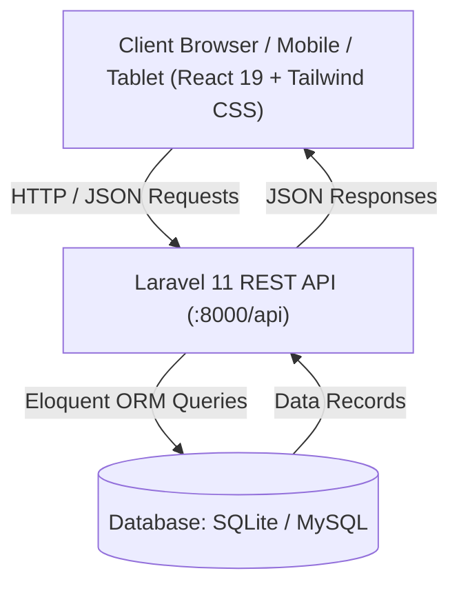

# 🚴 Vjay's Bike Parts & Accessories Management System

A modern, high-performance inventory and floor-operations management system tailored for bike shops, parts retailers, and repair workshops. Built with a responsive **React 19 + TypeScript + Vite + Tailwind CSS** frontend and a robust **Laravel 11 RESTful API** backend.

---

## 📋 Table of Contents
- [Overview & Key Features](#-overview--key-features)
- [System Architecture](#-system-architecture)
- [Tech Stack](#-tech-stack)
- [Prerequisites](#-prerequisites)
- [Quick Start Installation Guide](#-quick-start-installation-guide)
  - [1. Clone Repository](#1-clone-repository)
  - [2. Backend Setup (Laravel API)](#2-backend-setup-laravel-api)
  - [3. Frontend Setup (React + Vite)](#3-frontend-setup-react--vite)
- [Database Configuration](#-database-configuration)
- [API Endpoints Reference](#-api-endpoints-reference)
- [Project Directory Structure](#-project-directory-structure)
- [Deployment](#-deployment)
- [Contributing & License](#-contributing--license)

---

## 🌟 Overview & Key Features

### 1. 📊 Executive & Shop-Floor Dashboard
- **Valuation & Metrics**: Real-time calculation of total retail inventory valuation and parts catalog breadth.
- **Stock Movements Volume**: Live monthly tracking of stock inflow and sales dispatch volume.
- **Restock Queue**: Automatic threshold alerts highlighting parts running low on stock.
- **Quick Action Triggers**: Immediate shortcuts for floor stock intake and counter dispatch.

### 2. 🚲 Category-Driven Parts Catalog
- **Structured Categories**: Organized catalog covering Braking Systems, Handlebars & Grips, Drivetrain & Chains, Wheels & Tires, and Riding Accessories.
- **Dynamic Search & Filtering**: Instant debounce search by SKU, part name, and brand.
- **Part Management**: Add new inventory, update specifications, adjust pricing, and track safety buffer thresholds.

### 3. 📦 Stock Movement Operations (Floor Intake & Dispatch)
- **Stock In (Intake)**: Register received supplier deliveries with reference invoice numbers, supplier metadata, and batch quantities.
- **Stock Out (Dispatch)**: Record counter sales, repair shop allocations, and customer dispatches with automatic stock reduction.
- **Real-Time Synchronized Stock**: Automatic updates across product catalogs and dashboard widgets.

### 4. 🛡️ Immutable Audit Logs & Verification Ledger
- Complete audit trail recording every inventory change, stock in/out transaction, and administrative edit.
- Timestamped logs with operator identifiers, exact quantity deltas, and reference notes for dispute-free inventory counting.

### 5. 🔐 Fast Shop-Floor PIN Authentication
- Fast **6-digit PIN login** designed for rapid counter POS / tablet usage on the shop floor.
- Operator registration, secure password hashing, and forgot PIN recovery workflow.

---

## 🏗️ System Architecture



---

## 💻 Tech Stack

### Frontend
- **Framework**: React 19 (TypeScript)
- **Bundler & Tooling**: Vite 7
- **Styling**: Tailwind CSS 3, PostCSS, Autoprefixer
- **UI Components & Icons**: Radix UI primitives, Lucide React, React Icons
- **Routing**: React Router DOM v6
- **Animations**: Framer Motion

### Backend
- **Framework**: Laravel 11 (PHP 8.2+)
- **API Standard**: RESTful JSON API
- **ORM**: Eloquent ORM
- **Database**: SQLite (default zero-config) or MySQL

---

## ⚙️ Prerequisites

Ensure you have the following installed on your machine:
- **Node.js**: `v18.0.0` or higher ([Download Node.js](https://nodejs.org/))
- **PHP**: `v8.2.0` or higher ([Download PHP](https://www.php.net/downloads))
- **Composer**: PHP dependency manager ([Download Composer](https://getcomposer.org/))
- **Git**: ([Download Git](https://git-scm.com/))
- *(Optional)* **MySQL**: If using MySQL instead of the default SQLite.

---

## 🚀 Quick Start Installation Guide

### 1. Clone Repository

```bash
git clone https://github.com/Marty-dev-arch/IT-12---Final-Project-Vjays-Bike.git
cd IT-12---Final-Project-Vjays-Bike
```

---

### 2. Backend Setup (Laravel API)

Open a terminal and navigate to the `backend` directory:

```bash
cd backend
```

#### Step 2.1: Install PHP Dependencies
```bash
composer install
```

#### Step 2.2: Configure Environment Variables
Copy `.env.example` to `.env`:
- **Windows (Command Prompt / PowerShell):**
  ```powershell
  copy .env.example .env
  ```
- **macOS / Linux:**
  ```bash
  cp .env.example .env
  ```

#### Step 2.3: Generate Application Key
```bash
php artisan key:generate
```

#### Step 2.4: Prepare Database & Run Migrations
By default, the backend uses **SQLite** for zero-configuration setup.

Run the migrations and seed default parts & demo data:
```bash
php artisan migrate --seed
```

> **Note for MySQL users:** If you prefer MySQL, create a database named `vjays_bike` and update your `backend/.env` file:
> ```env
> DB_CONNECTION=mysql
> DB_HOST=127.0.0.1
> DB_PORT=3306
> DB_DATABASE=vjays_bike
> DB_USERNAME=root
> DB_PASSWORD=your_password
> ```

#### Step 2.5: Start the Laravel API Server
```bash
php artisan serve --port=8000
```
The API is now running at: **`http://localhost:8000`**

---

### 3. Frontend Setup (React + Vite)

Open a **second terminal** and navigate to the project root directory:

#### Step 3.1: Install NPM Dependencies
```bash
npm install
```

#### Step 3.2: Start the Vite Development Server
```bash
npm run dev
```

The frontend will run at: **`http://localhost:5173`** (or the URL displayed in your terminal).

Open `http://localhost:5173` in your browser to access the application!

---

## 🗄️ Database Configuration

| Driver | Config in `backend/.env` | Notes |
|---|---|---|
| **SQLite (Default)** | `DB_CONNECTION=sqlite` | Zero setup required. Uses `database/database.sqlite`. |
| **MySQL** | `DB_CONNECTION=mysql` | Production-ready. Configure host, port, user, and password in `.env`. |

To reset and re-seed sample inventory at any time:
```bash
php artisan migrate:fresh --seed
```

---

## 🔌 API Endpoints Reference

| Method | Endpoint | Description |
|---|---|---|
| `POST` | `/api/auth/register` | Register new employee/user phone number |
| `POST` | `/api/auth/create-pin` | Set or update 6-digit secure PIN |
| `POST` | `/api/auth/login` | Authenticate with phone number & 6-digit PIN |
| `POST` | `/api/auth/forgot-pin/send-code` | Request PIN reset verification code |
| `POST` | `/api/auth/forgot-pin/verify-code` | Verify 6-digit phone verification code |
| `POST` | `/api/auth/forgot-pin/reset-pin` | Set new PIN using verified code |
| `GET` | `/api/products` | Retrieve catalog (supports `?category=` and `?search=`) |
| `POST` | `/api/products` | Create a new part in catalog |
| `GET` | `/api/products/{id}` | Retrieve part details |
| `PUT` | `/api/products/{id}` | Update part specifications & stock threshold |
| `DELETE` | `/api/products/{id}` | Remove part from catalog |
| `GET` | `/api/stock-movements` | List all historical stock movements |
| `POST` | `/api/stock-movements/in` | Floor stock-in intake operation |
| `POST` | `/api/stock-movements/out` | Floor stock-out sales dispatch operation |
| `GET` | `/api/dashboard/stats` | Valuation, inventory breadths, and movement statistics |
| `GET` | `/api/dashboard/restock-queue` | Products below safety stock threshold |
| `GET` | `/api/dashboard/recent-movements`| 5 most recent floor operations |
| `GET` | `/api/audit-logs` | Immutable audit log ledger |

---

## 📁 Project Directory Structure

```text
├── api/                    # Vercel serverless PHP entry point
├── backend/                # Laravel 11 Backend API
│   ├── app/
│   │   ├── Http/Controllers/Api/  # REST API Controllers (Auth, Product, Stock, Dashboard)
│   │   └── Models/                # Eloquent Models (Product, StockMovement, User, AuditLog)
│   ├── config/             # Application configuration
│   ├── database/
│   │   ├── migrations/     # Database migration schemas
│   │   └── seeders/        # Catalog seeders with realistic bike parts
│   ├── routes/
│   │   └── api.php         # Defined REST endpoints
│   ├── .env.example        # Backend environment template
│   └── composer.json       # PHP packages & autoloading
├── public/                 # Static assets
├── src/                    # Frontend Application (React 19 + TypeScript)
│   ├── components/         # Reusable UI components & layouts
│   ├── context/            # Global state (AuthContext, InventoryContext)
│   ├── pages/
│   │   ├── auth/           # Login, Register, Create PIN, Reset PIN
│   │   ├── dashboard/      # Executive & Operations Dashboard
│   │   ├── operations/     # Stock Movement & Audit Logs
│   │   └── products/       # Category-wise product management
│   ├── services/           # Axios / Fetch API client integration
│   ├── types/              # TypeScript interfaces & types
│   ├── App.tsx             # Route definitions & navigation
│   └── main.tsx            # React application entry point
├── index.html              # HTML template
├── package.json            # Node.js dependencies & scripts
├── tailwind.config.js      # Tailwind CSS styling configuration
├── tsconfig.json           # TypeScript configuration
├── vercel.json             # Vercel deployment configuration
└── README.md               # Main project documentation
```

---

## 🌐 Deployment

### Vercel Deployment
The repository includes a ready-to-use `vercel.json` and `api/index.php` serverless bridge for deploying both the Vite frontend and PHP backend together on Vercel.

1. Connect your repository to [Vercel](https://vercel.com/).
2. Set Build Command: `npm run build`
3. Output Directory: `dist`
4. Set required Environment Variables in the Vercel Dashboard.

---

## 👥 Contributors & Acknowledgements
- **Author**: Marty-dev-arch
- **Course / Project**: IT-12 - Final Project (Vjay's Bike & Accessories)

---

## 📄 License
This project is open-source under the [MIT License](LICENSE).
